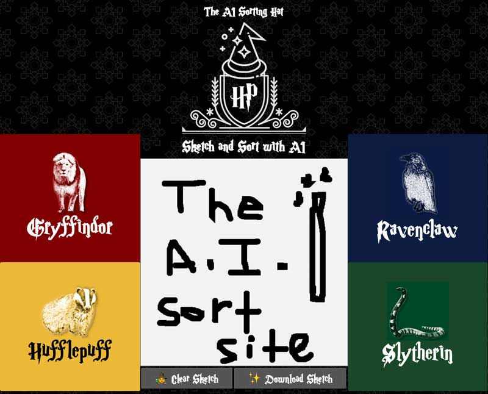
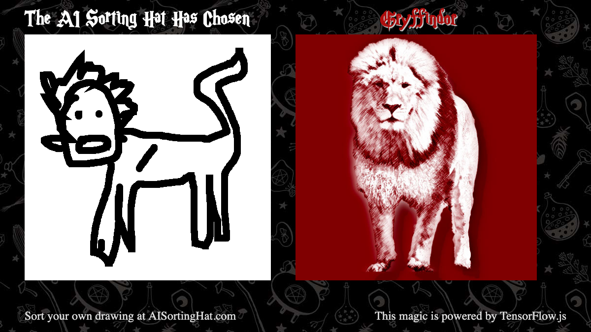
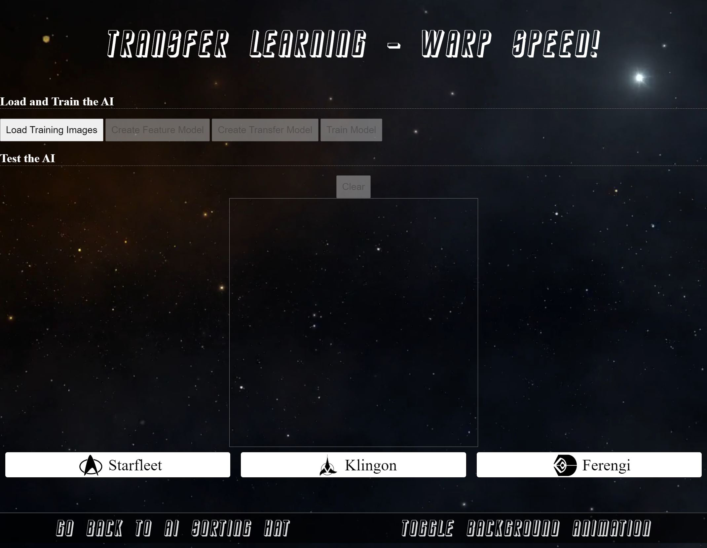

# AI Sorting Hat
### Use AI to sort you into your wizarding house

Doodle an animal and get sorted int your own Hogwarts house.

Powered by [TensorFlow.js](https://www.tensorflow.org/js/) this site uses drawings by Google's Quick, Draw! datacet to identify your drawings.  Draw a Lion, Raven, Badger, or Serpent, but don't draw a skull ;)

Use the dataset yourself:  https://www.kaggle.com/gantlaborde/riddikulus

Your result drawings are downloadable with the prediction.

## Transfer Learning Bonus

If you're interested in checking out Transfer Learning in TFJS, you can check out https://aisortinghat.com/transfer/

